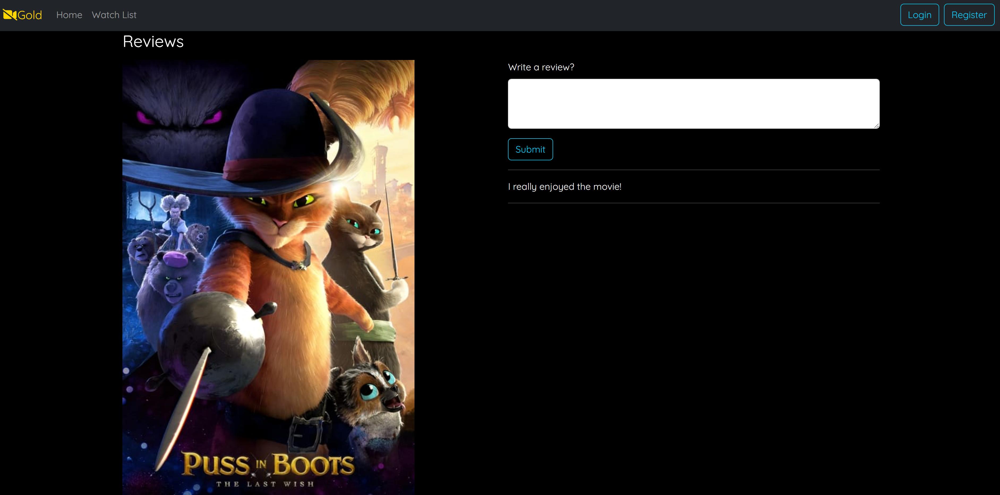

# Movies

Movies is a web-based platform enabling movie enthusiasts to explore a diverse collection of films, watch trailers, and share their reviews. With its user-friendly interface, users can effortlessly navigate through the movie listings, delve into detailed movie pages, and engage in discussions through reviews. The application is built with a robust backend ensuring a smooth user experience while managing movie data and user reviews efficiently.

## Table of Contents
- [Installation](#installation)
- [Technologies](#technologies)
- [Screenshots](#screenshots)
- [API Endpoints](#api-endpoints)
- [Database Schema](#database-schema)
- [Frontend Routes](#frontend-routes)
- [Credits](#credits)
- [Contact](#contact)

## Installation
Ensure you have the following installed on your machine:

### Backend:
- **Java: Version 17**
- **Maven: Version 3.6** (or newer)
- **Spring Boot: Version 3.1.3**

### Frontend:
- **Node.js: Version 14** (or newer)
- **React: Version 18.2.0**
- **React-Scripts: Version 5.0.1**

### Database:
- **MongoDB: (compatible version with Spring Boot 3.1.3)**

Instructions:
1. Clone the repository to your local machine.
2. Set up your MongoDB database using the content of the `Movies/data/movies.json`
3. Navigate to the `front-client` directory.
4. Create a `.env` file and define the `REACT_APP_API_ROOT_URL` parameter there. When developing locally, the value can be `http://localhost:8080/`
5. Run `npm install` to install frontend dependencies.
6. Run `npm run build` to build the frontend application. The build files will be copied to the Spring application's `resources/public` directory.
7. Navigate back to the project root directory.
8. Create another `.env` file under `Movies/src/main/resources/` and define these parameters there: `MONGO_DATABASE, MONGO_USER, MONGO_PASSWORD, MONGO_CLUSTER`. These values will be used in the `application.properties` file.
9. Run `mvn install` to install backend dependencies.
10. Run `mvn spring-boot:run` to start the Spring application.
11. Once the application is running, open your web browser and navigate to `http://localhost:8080` to access the Movies application.

## Technologies
- **Backend**:
  - Java
  - Spring Boot
  - Maven
  - MongoDB
- **Frontend**:
    - React
    - Bootstrap
    - Axios

## Screenshots

## API Endpoints
- `/api/v1/movies`: Get a list of all movies.
- `/api/v1/movies/{movieId}`: Get detailed information of a specific movie.
- `/api/v1/reviews/{movieId}`: Post a new review for a specific movie.

## Database Schema
- Movies Collection:
    - imdbId: String
    - title: String
    - releaseDate: Date
    - trailerLink: String
    - genres: Array of Strings
    - poster: String
    - backdrops: Array of Strings
    - reviewIds: Array of Strings

## Frontend Routes
- `/`: Home page listing all movies.
- `/Trailer/:ytTrailerId`: Page displaying the trailer of a specific movie.
- `/Reviews/:movieId`: Page displaying reviews and a form to post a new review for a specific movie.

## Credits
This project was inspired and guided by a tutorial from [FreeCodeCamp](https://www.youtube.com/@freecodecamp).

## Contact
- Email: [hamidreza74hrr@yahoo.com](mailto:hamidreza74hrr@yahoo.com)
- LinkedIn: [Hamid Reza Rezaei](https://www.linkedin.com/in/hamid-reza-rezaei-17896a125/)

